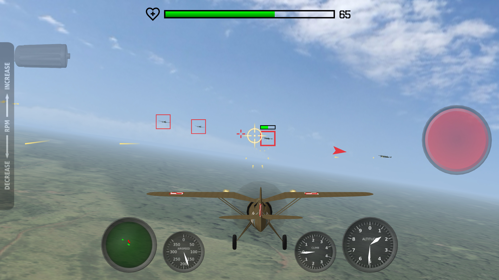
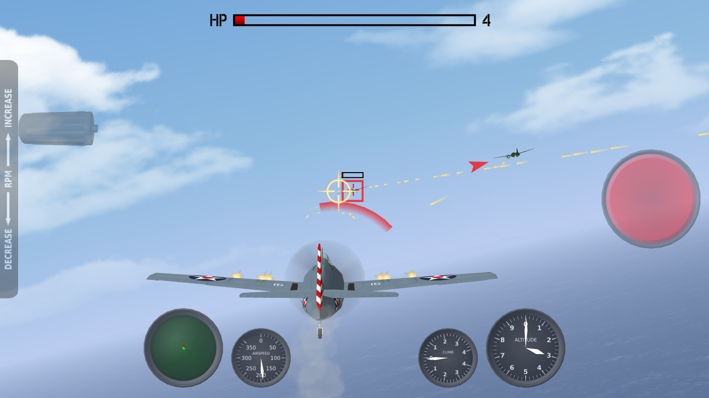
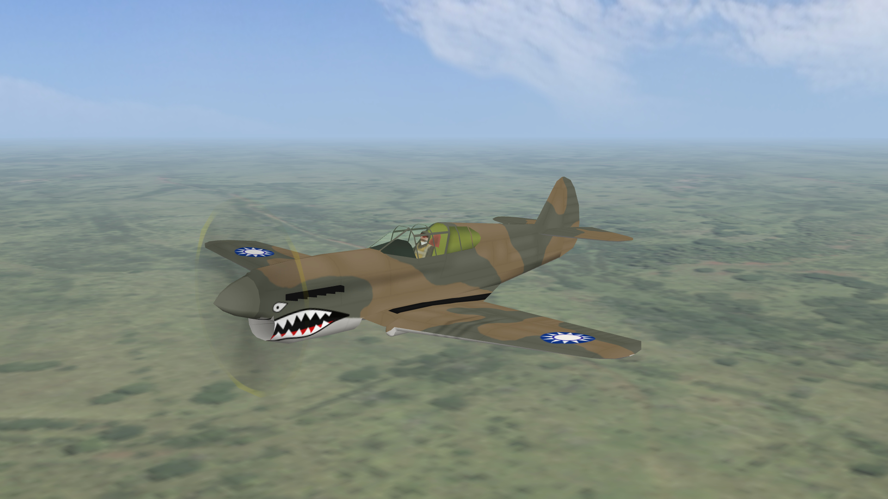
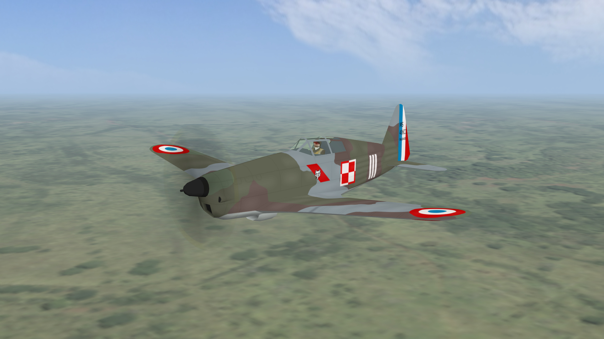
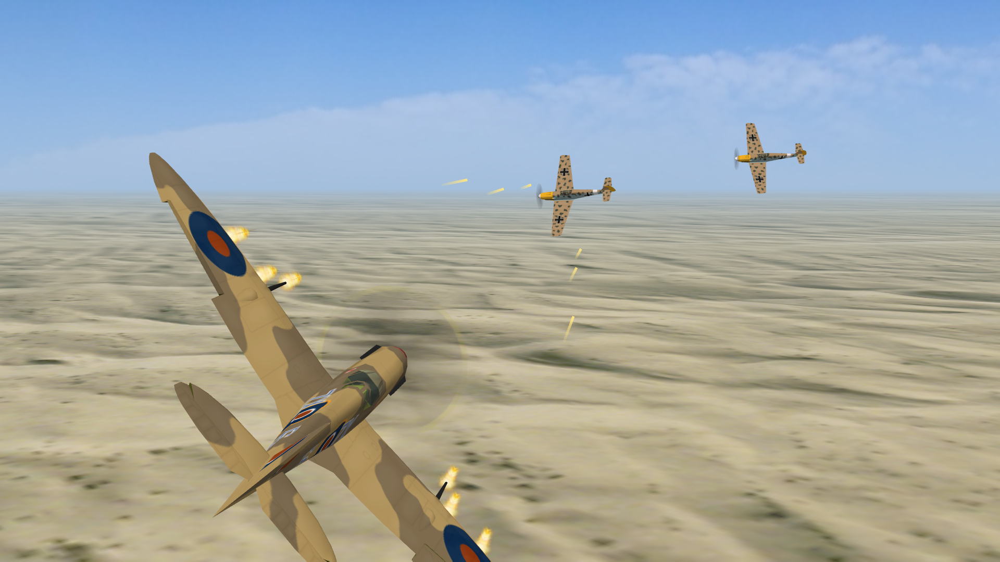
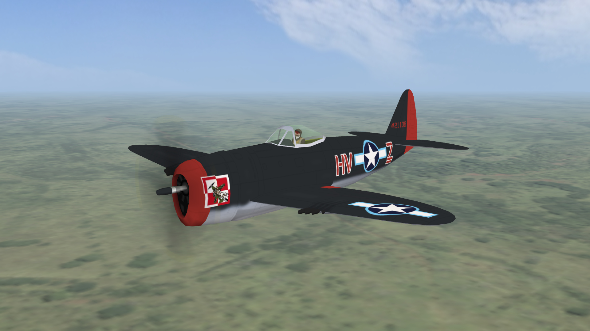

# flight-simulation-game
An arcade style combat flight simulation video game engine written in C++ intended to be used with mobile devices such as smartphones and tablets as well as smart TVs and set-top boxes.

## Released Games
- [Fighters over the Pacific](https://play.google.com/store/apps/details?id=com.omnitech_software.fotp)
- [Fighters: Polish Aces](https://play.google.com/store/apps/details?id=com.omnitech_software.fpa)

## Tools
- [Missions Editor](https://github.com/marek-cel/flight-simulation-game-missions-editor)
- [Terrain Generator](https://github.com/marek-cel/flight-simulation-game-terrain-generator)
